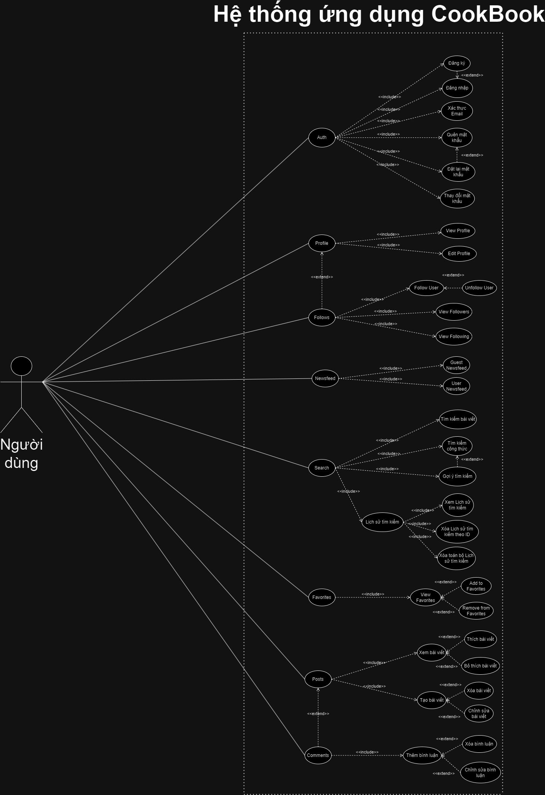
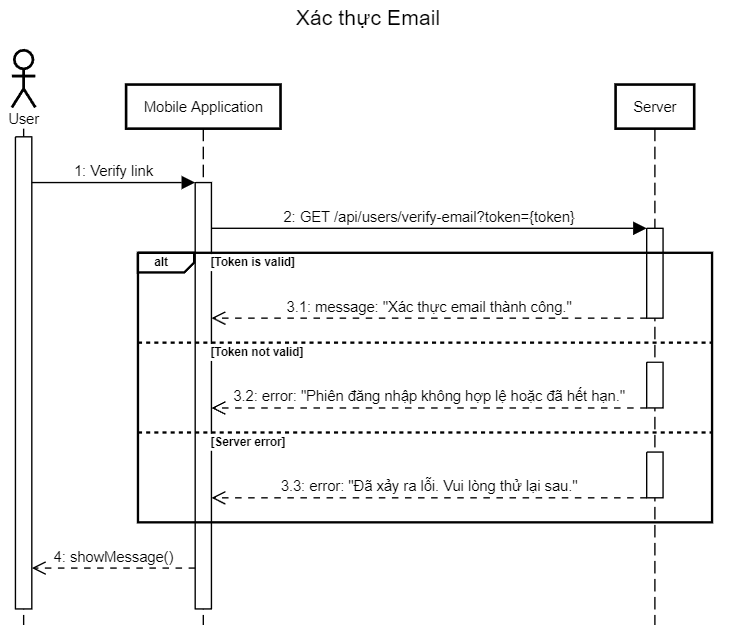
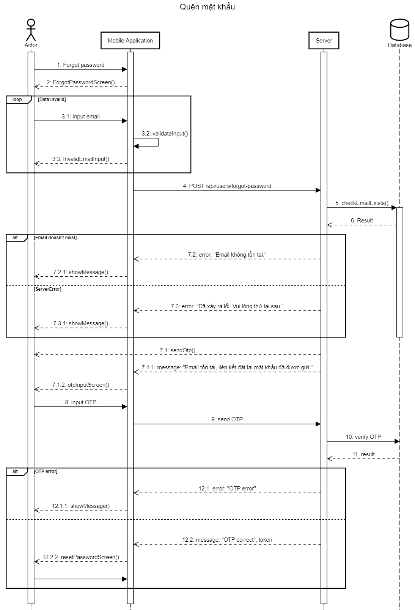

<h1>Use-case Diagram</h1>

<h1>Sequence Diagrams</h1>
<h2>Auth</h2>
Login

Register

VerifyEmail

ForgotPassword

ChangePassword

ResetPassword

<h2>Profile</h2>
GetUserProfile

UpdateProfile

<h2></h2>
