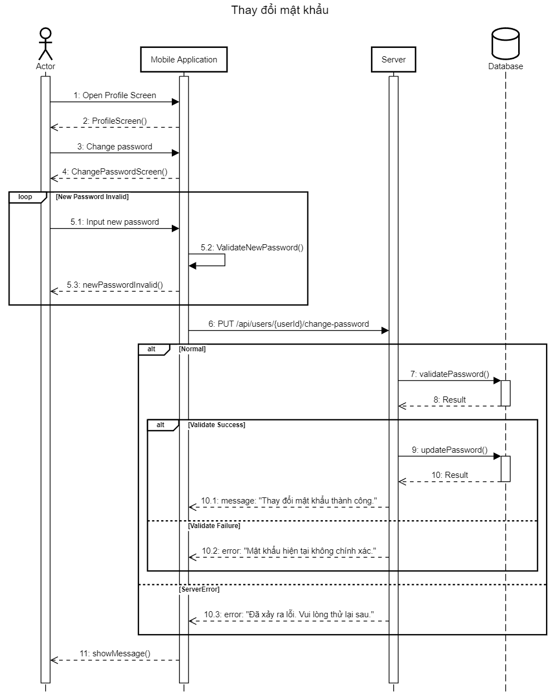
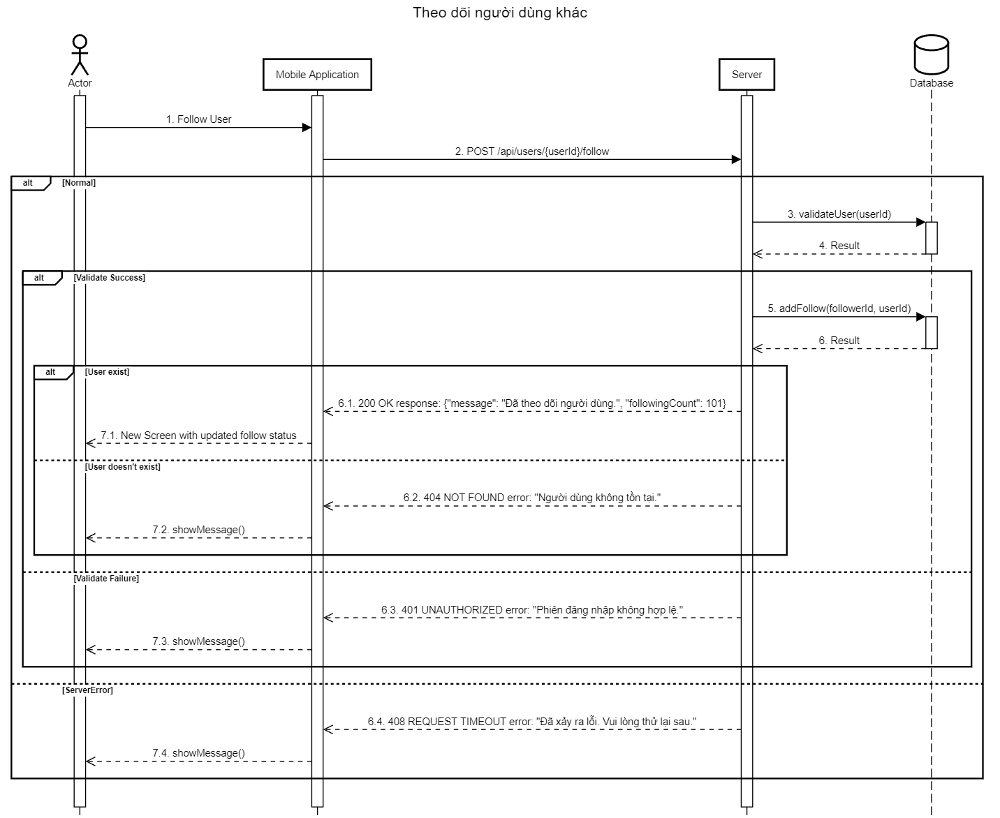
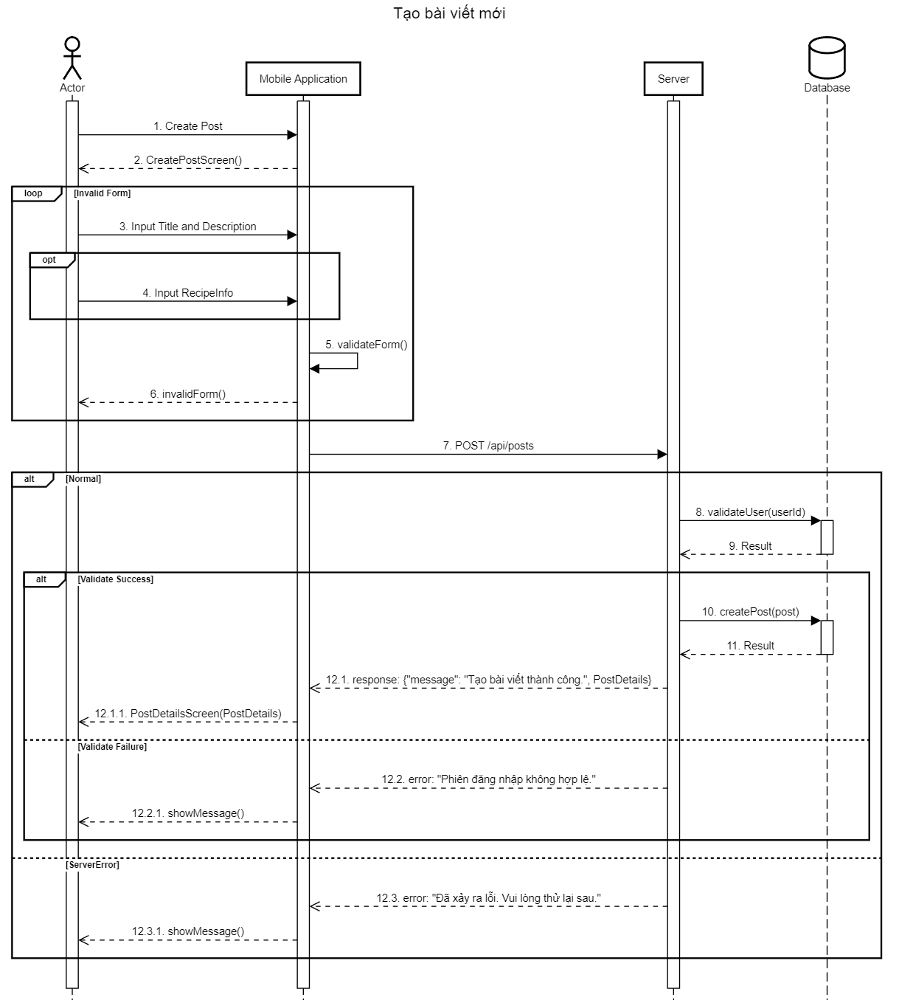
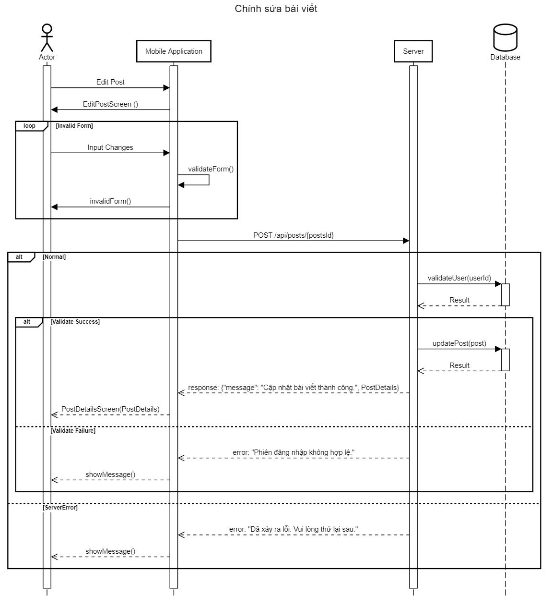
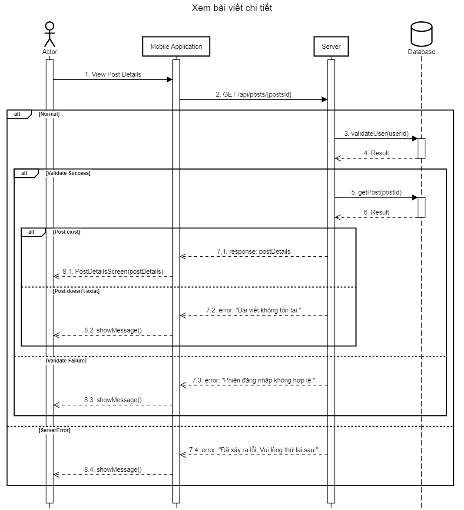
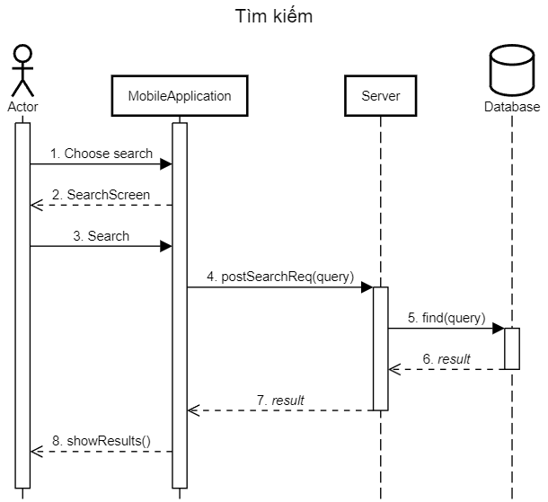

<h1>Use-case Diagram</h1>

<h1>Sequence Diagrams</h1>
<h2>Auth</h2>

<h2>Comments</h2>

<h2>Favorites</h2>

<h2>Follows</h2>

<h2>Newsfeed</h2>

<h2>Notifications</h2>

<h2>Posts</h2>

<h2>Search</h2>

<h2>User Profile</h2>

